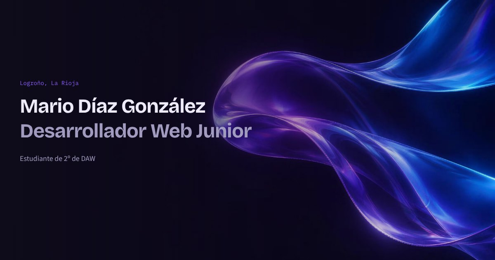

# Mario Díaz González · Portfolio

Personal portfolio of Mario Díaz González, a 2nd-year Web Application Development (DAW) student in Logroño, Spain.

**Live site:** https://mk-1379.github.io/



## Features

- Prerendered at build time with `vite-ssg`, so the HTML already contains all the content (faster first load and better SEO).
- Light and dark themes with a manual toggle, saved in `localStorage` and applied before the first paint to avoid flashing.
- Theme-aware hero background (AVIF with WebP fallback) with a subtle entrance and drift animation.
- Accessible by design: skip link, keyboard-friendly mobile menu (`aria-expanded`, Escape to close), visible focus states, descriptive link text for screen readers and `prefers-reduced-motion` support.
- All content (profile, projects, skills, gaming stats) lives in typed data files under `src/data/`, separate from the components.
- Open Graph and Twitter Card metadata for link previews.
- Automatic deployment to GitHub Pages with GitHub Actions on every push to `main`.

## Tech stack

- [Vue 3](https://vuejs.org/) with `<script setup>` and TypeScript
- [Vite](https://vite.dev/) and [vite-ssg](https://github.com/antfu-collective/vite-ssg)
- [Vue Router](https://router.vuejs.org/)
- [Tailwind CSS 4](https://tailwindcss.com/) with design tokens defined as CSS variables
- Self-hosted fonts via [Fontsource](https://fontsource.org/): Bricolage Grotesque, Source Sans 3 and IBM Plex Mono
- ESLint, Oxlint and Prettier

## Getting started

Requires Node.js 22.18+ or 24.12+.

```bash
git clone https://github.com/MK-1379/MK-1379.github.io.git
cd MK-1379.github.io
npm install
npm run dev
```

| Command | What it does |
|---|---|
| `npm run dev` | Starts the development server |
| `npm run build` | Type-checks and builds the prerendered site into `dist/` |
| `npm run preview` | Serves the production build locally |
| `npm run type-check` | Runs `vue-tsc` |
| `npm run lint` | Runs Oxlint and ESLint |

## Project structure

```text
.github/workflows/deploy.yml   Build and deploy to GitHub Pages
public/                        Static files: images, social preview, favicon
src/
  assets/main.css              Tailwind import, theme tokens and animations
  components/                  Page sections and UI pieces
  composables/useTheme.ts      Theme state and persistence
  data/                        Editable content (profile, projects, skills, LoL stats)
  router/index.ts              Route list used by vite-ssg
  types/index.ts               TypeScript interfaces for the data
  views/HomeView.vue           Home page composed from the sections
  main.ts                      App entry point (ViteSSG)
```

## Editing the content

Most changes only need one file in `src/data/`:

- `profile.ts`: name, role, contact links and the "About me" text
- `projects.ts`: the projects list
- `skills.ts`: skills and their experience level
- `lol.ts`: League of Legends stats (updated manually; the date is shown on the page)

## Credits

- The hero background images were generated with AI ([Higgsfield](https://higgsfield.ai/)).
- League of Legends rank and position icons come from the [Riot Developer Portal](https://developer.riotgames.com/docs/lol). This portfolio was created under Riot Games' "Legal Jibber Jabber" policy using assets owned by Riot Games. Riot Games does not endorse or sponsor this project.
- Fonts are distributed under the SIL Open Font License.
